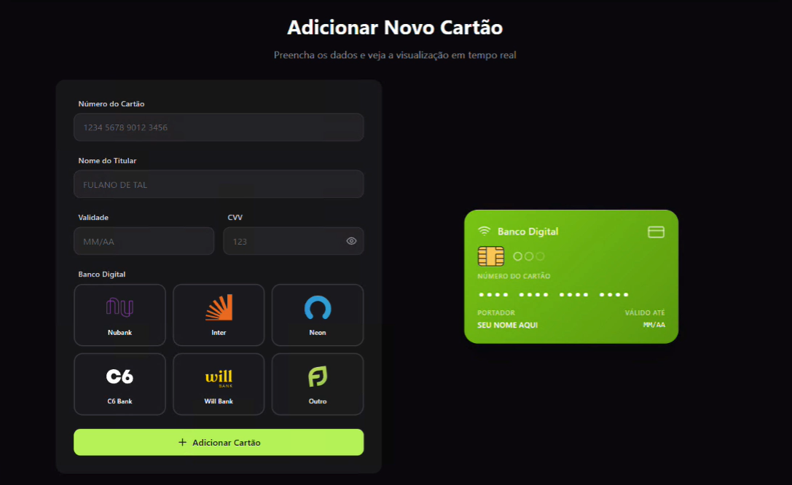

# 🧪 Domine os Testes de Componentes com Cypress

> **Projeto prático:** Cardify — Fintech de carteiras digitais.  
> Curso: *Domine os Testes de Componentes com Cypress e conquiste o controle da qualidade em aplicações modernas.*

---

<p align="center">
  
  
  
  
</p>

---

<p align="center">
  <!-- Testes e QA -->
  
  
  
  
  <!-- Versionamento -->
  
  
</p>

---

## 📑 Sumário

- [🧪 Domine os Testes de Componentes com Cypress](#-domine-os-testes-de-componentes-com-cypress)
  - [📑 Sumário](#-sumário)
  - [📘 Visão Geral](#-visão-geral)
  - [🎯 O que você vai aprender](#-o-que-você-vai-aprender)
  - [🧩 Funcionalidade em foco](#-funcionalidade-em-foco)
    - [Adicionar Novo Cartão](#adicionar-novo-cartão)
  - [🧠 Tecnologias e Ferramentas](#-tecnologias-e-ferramentas)
  - [🧱 Estrutura do Projeto](#-estrutura-do-projeto)
  - [🎓 Interface e link para o Curso](#-interface-e-link-para-o-curso)

---

## 📘 Visão Geral

Este repositório faz parte de um curso imersivo de **Quality Assurance com Cypress**, onde você assume o papel de QA na **Cardify**, uma fintech moderna focada em carteiras digitais que gerenciam múltiplos cartões de crédito.

O objetivo é dominar **Testes de Componentes com Cypress**, garantindo qualidade *bulletproof* em aplicações **React** e aplicando estratégias inteligentes de automação que vão além dos testes End-to-End.

---

## 🎯 O que você vai aprender

- Como configurar o **Cypress Component Testing** do zero.  
- Criar **testes isolados** para componentes React com cenários reais.  
- Definir **localizadores robustos** (`data-cy`) e manter os testes resilientes.  
- Simular requisições de API com `cy.intercept()`.  
- Controlar diferentes estados de componentes com *mocking*.  
- Validar estilos, mensagens de erro e feedbacks visuais.  
- Entender diferenças entre testes **E2E** e **CT (Component Testing)**.  
- Adquirir autonomia como QA em times ágeis com aplicações modernas.

---

## 🧩 Funcionalidade em foco

### Adicionar Novo Cartão

Formulário para cadastro e visualização em tempo real de cartões digitais.

| Campo | Descrição |
|-------|------------|
| Número do Cartão | Entrada numérica formatada |
| Nome do Titular | Texto obrigatório |
| Validade | Mês/Ano com validação automática |
| CVV | 3 ou 4 dígitos numéricos |
| Banco Digital | Seleção de bandeira/banco (Nubank, Inter, Neon, C6, Will Bank, Outro) |

---

## 🧠 Tecnologias e Ferramentas

| Categoria | Ferramenta |
|------------|-------------|
| Framework de Testes | **Cypress 13+ (Component Testing)** |
| Frontend | **React + Vite** |
| Estilização | **Tailwind CSS** |
| Controle de Versão | **Git + GitHub** |
| Gerenciamento de Pacotes | **Node.js + npm** |
| Linter e Formatação | ESLint + PostCSS |
| Execução | `vite dev` / `npm run cy:open` |

---

## 🧱 Estrutura do Projeto

```bash
QA_Proj_Cypress_Cardify/
│
├── src/
│   ├── assets/brands/          # Logos dos bancos e ícones
│   ├── components/             # Componentes reutilizáveis (Header, Footer, CardPreview)
│   ├── pages/                  # Páginas principais (AddCard, Landing, Upgrade)
│   ├── services/               # cardService.js → lógica de API
│   ├── utils/                  # Validações e helpers (cardValidation, bankColors)
│   ├── index.css               # Estilos globais (Tailwind)
│   ├── App.jsx / main.jsx      # Entrada do app React
│
├── cypress/
│   ├── fixtures/               # Massas de teste
│   ├── support/                # Commands e configuração do CT
│   └── component-tests/        # AddCard.cy.jsx (testes de componentes)
│
├── public/                     # Ícones, favicon, manifest
├── vite.config.js              # Configuração do Vite
├── tailwind.config.js          # Configuração do Tailwind
├── package.json                # Dependências do projeto
└── README.md
````

---

## 🎓 Interface e link para o Curso

Link do curso na Udemy:
👉 [**Domine os Testes de Componentes com Cypress**](https://www.udemy.com/course/testando-componentes-com-cypress/)
Instrutor: **Fernando Papito**

---

<p align="center">
  
  <br>
  <em>🖼️ Tela principal — fluxo de adição de cartão e validação em tempo real.</em>
</p>
```

---